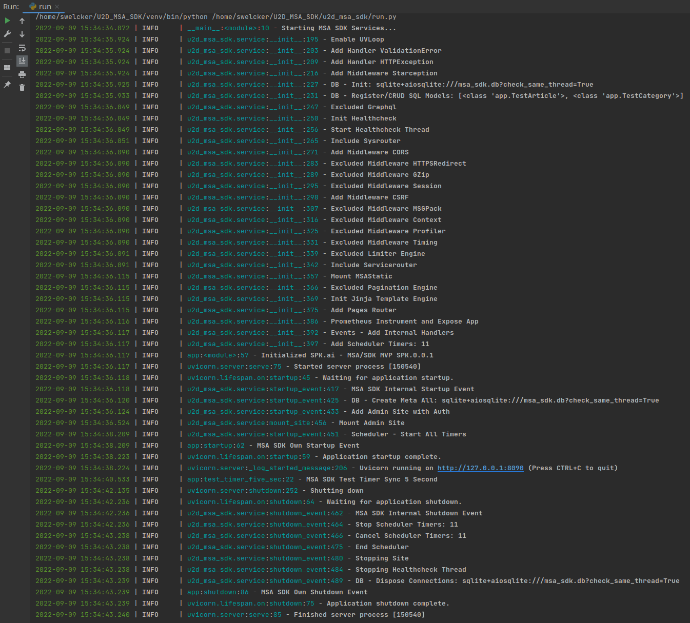
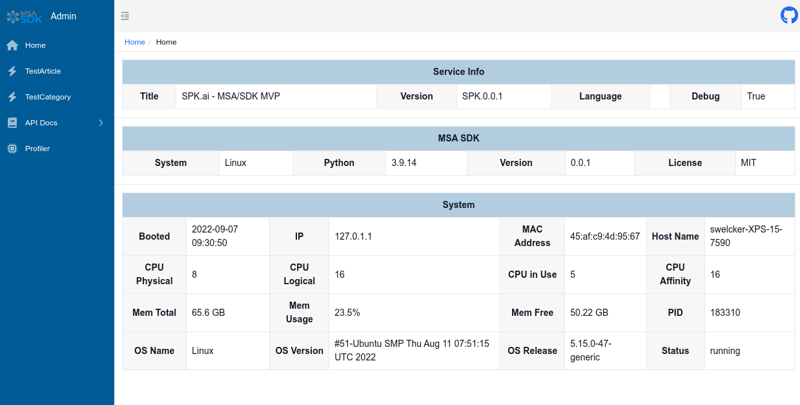
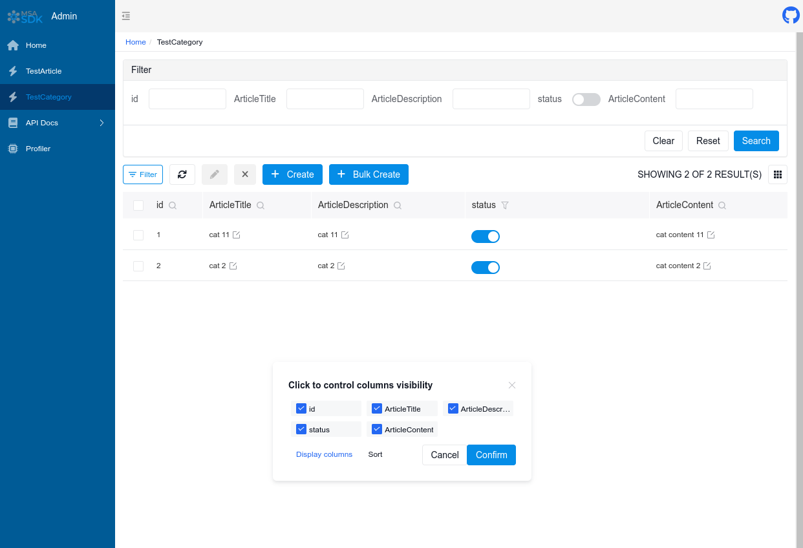
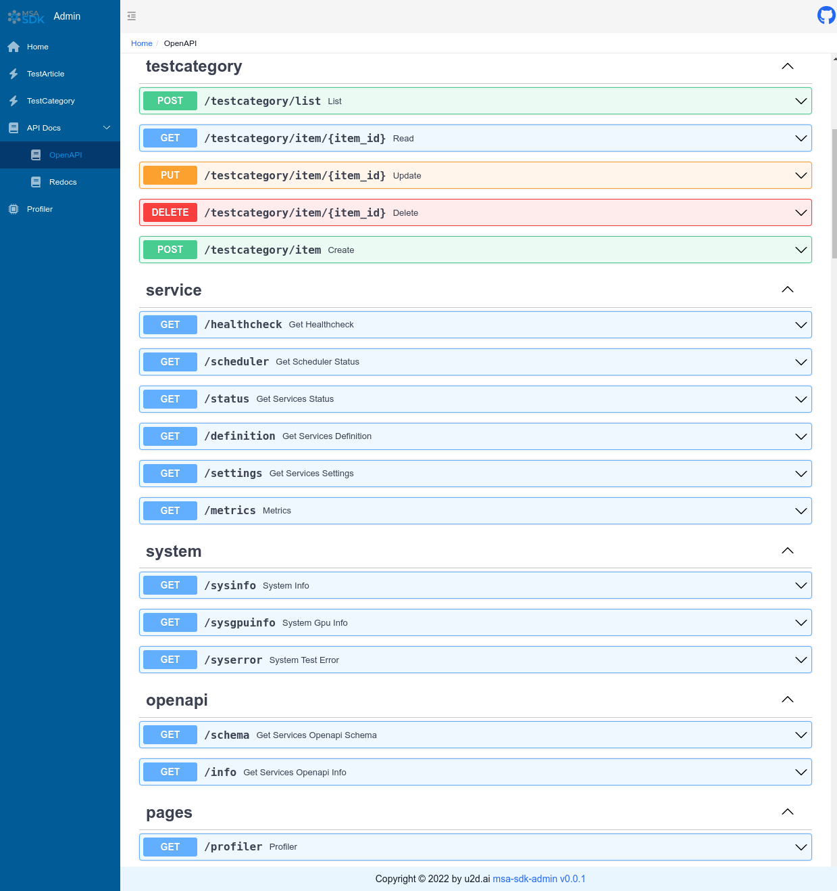
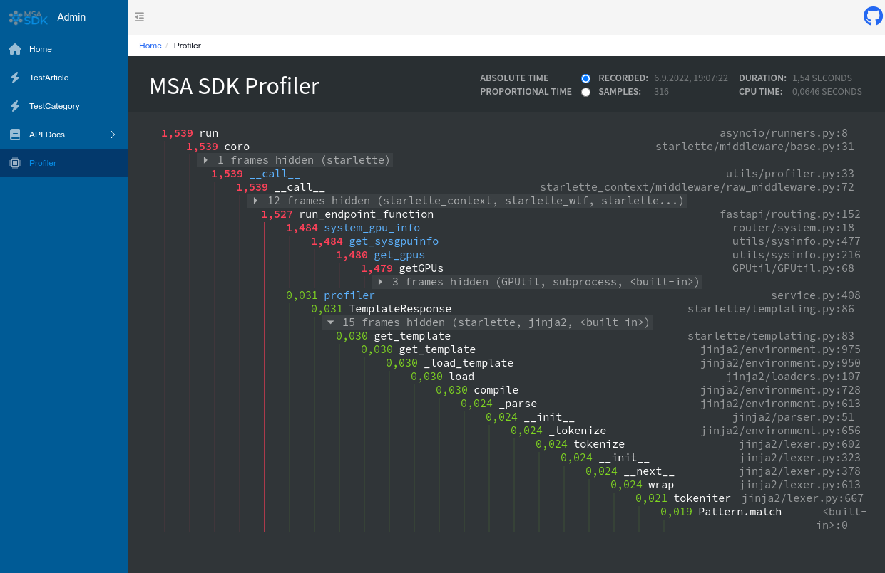

<p align="center">
  
</p>

------
<p align="center">
    <em>msaSDK - FastAPI based Microservice Architecture Development Kit</em>
<br>
    To build PoC's, MVP's, API's with CRUD and Dashboards fast and consistent.
<br>
    Build on top of FastAPI, SQLModel, SQLAlchemy, Amis and many other bullet proofed libraries.
<br>
  <a href="https://pypi.org/project/msaSDK" target="_blank">
      
  </a>
  <a href="https://pypi.org/project/msaSDK" target="_blank">
      
  </a>
</p>

------

## Features
- **Build connected distributed applications faster**: Ready for [Dapr](https://dapr.io/)..
- **Consistency**: With sometimes 10s or 100s of Micro Services, the SDK helps to easy version control and provides a stable Dapr Basis.
- **High performance**: Based on [FastAPI](https://fastapi.tiangolo.com/zh/). Enjoy all the benefits.
- **High efficiency**: Perfect code type hints. Higher code reusability.
- **Support asynchronous and synchronous hybrid writing**: `ORM`  is based on`SQLModel` & `Sqlalchemy`. Freely customize
  database type. Asynchronous mode. Strong scalability.
- **Front-end separation**: The front-end is rendered by `Amis`, the back-end interface is automatically generated
  by `msaSDK - Admin`. The interface is reusable.
- **Strong scalability**: The background page supports `Amis` pages and ordinary `html` pages. Easily customize the
  interface freely.
- **Automatic api documentation**: Automatically generate Interface documentation by `FastAPI`. Easily debug and share
  interfaces.
- **Integrated Scheduler**: Define Scheduler Tasks with natural language timings and dependencies.
- **Dashboard UI**: Admin and Optional Auth enabled Dashboard with CRUD Forms.
- **Integrated CRUD**: Generates CRUD Router and Admin Dashboard Forms based on SQLModel and SQLAlchemy.
- **Integrated Abstract Filesystem**: Agnostic Abstract Filesystem API which allows to use S3, GCS, Azure Datalake, your local FS, Youtube etc.
- **Added justpy WEB UI**: Integrated justpy UI Web Framework to MSAAPI, which allows simple adding of routes to justpy webpages functions.

## Dependencies

- [FastAPI](https://fastapi.tiangolo.com/)
- [SQLModel](https://sqlmodel.tiangolo.com/)
  combined with  [SQLAlchemy](https://www.sqlalchemy.org/) and [Pydantic](https://pydantic-docs.helpmanual.io/), with all
  their features .
- [Amis](https://baidu.gitee.io/amis): Vue Frontend

### Usage example is in the app module \_\_init\_\_.py

```python
# -*- encoding: utf-8 -*-
from typing import Optional, List

from sqlmodel import SQLModel

from msaSDK.admin.utils.fields import Field
from msaSDK.models.service import get_msa_app_settings
from msaSDK.service import MSAApp


async def test_timer_min():
    app.logger.info("msaSDK Test Timer Async Every Minute")


def test_timer_five_sec():
    app.logger.info("msaSDK Test Timer Sync 5 Second")


class TestArticle(SQLModel, table=True):
    __table_args__ = {'extend_existing': True}
    id: Optional[int] = Field(default=None, primary_key=True, nullable=False)
    title: str = Field(title='ArticleTitle', max_length=200)
    description: Optional[str] = Field(default='', title='ArticleDescription', max_length=400)
    status: bool = Field(None, title='status')
    content: str = Field(title='ArticleContent')


class TestCategory(SQLModel, table=True):
    __table_args__ = {'extend_existing': True}
    id: Optional[int] = Field(default=None, primary_key=True, nullable=False)
    title: str = Field(title='ArticleTitle', max_length=200)
    description: Optional[str] = Field(default='', title='ArticleDescription', max_length=400)
    status: bool = Field(None, title='status')
    content: str = Field(title='ArticleContent')


get_msa_app_settings.cache_clear()
settings = get_msa_app_settings()
settings.title = "u2d.ai - MSA/SDK MVP"
settings.version = "0.0.1"
settings.debug = True

app = MSAApp(settings=settings, auto_mount_site=True,
             sql_models=[TestArticle, TestCategory],
             contact={"name": "msaSDK", "url": "http://u2d.ai", "email": "stefan@u2d.ai"},
             license_info={"name": "MIT", "url": "https://opensource.org/licenses/MIT", })

app.scheduler.task("every 1 min", func=test_timer_min )
app.scheduler.task("every 5 sec", func=test_timer_five_sec )

app.logger.info("Initialized " + settings.title + " " + settings.version)


@app.on_event("startup")
async def startup():
    app.logger.info("msaSDK Own Startup MSAUIEvent")
    #app.mount_site()


@app.on_event("shutdown")
async def shutdown():
    app.logger.info("msaSDK Own Shutdown MSAUIEvent")


if __name__ == '__main__':
    pass
```

# Typical Run Log


## Interface Preview


#### Home Screen with System Info
- Open `http://127.0.0.1:8090/admin/` in your browser:


#### CRUD of SQLModels Screen


#### Login Screen
- Open `http://127.0.0.1:8090/admin/auth/form/login` in your browser:


#### OpenAPI Interactive Documentation (Swagger) Screen
- Open `http://127.0.0.1:8090/#/admin/docs` in your browser:


#### Profiler Screen
- Open `http://127.0.0.1:8090/#/admin/profiler` in your browser:


## License Agreement

- `msaSDK`Based on `MIT` open source and free to use, it is free for commercial use, but please clearly show the copyright information about msaSDK - Auth Admin in the display interface.


## How to create the documentation

We use mkdocs and mkdocsstring. The code reference and nav entry get's created virtually by the triggered python script /docs/gen_ref_pages.py while ``mkdocs`` ``serve`` or ``build`` is executed.

### Requirements Install for the PDF creation option:
PDF Export is using mainly weasyprint, if you get some errors here pls. check there documentation. Installation is part of the msaSDK, so this should be fine.

We can now test and view our documentation using:

    mkdocs serve

Build static Site:

    mkdocs build


## Build and Publish
  
Build:  

    python setup.py sdist

Publish to pypi:

    twine upload dist/*