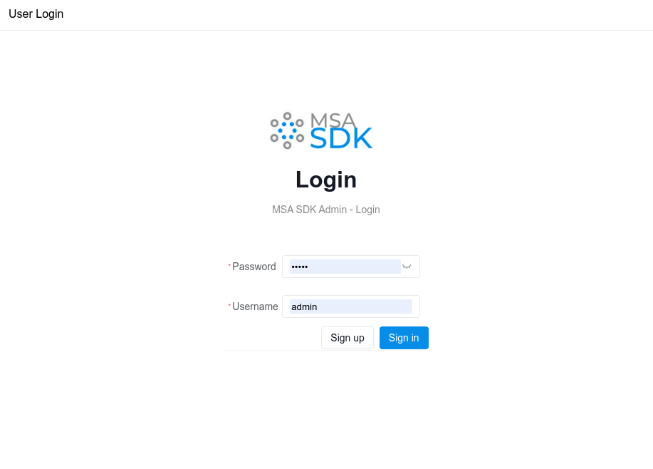
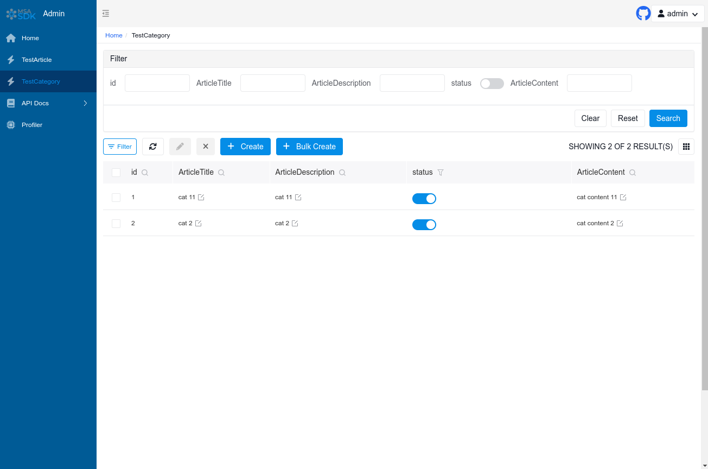
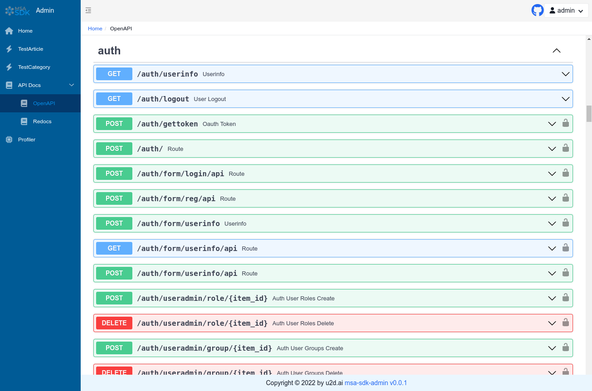

# Auth Admin Site

<h2 align="center">
  MSA SDK Auth
</h2>

---
<p align="center">
    <em>MSA SDK Auth.</em><br/>
    <em>Auth Site that extends the Admin Site Web UI with Login/Auth for the API's.</em>
</p>

---

## Simple Example

Just define in the Service Definition (Settings)

    site_auth: bool = False

```python
# -*- encoding: utf-8 -*-
"""
Copyright (c) 2022 - U2D.ai / S.Welcker
"""
__version__ = "0.0.1"

from u2d_msa_sdk.models.service import get_msa_app_settings
from u2d_msa_sdk.service import MSAApp

# get the MSA app setting, clear the cache, set some settings
get_msa_app_settings.cache_clear()
settings = get_msa_app_settings()
settings.title = "SPK.ai - MSA/SDK MVP"
settings.version = "SPK.0.0.1"
settings.debug = True
settings.site_auth = True

# Create the main app instance, like FastAPI but provide a Setting Definition Instance
# Define if the optional Admin Site gets mounted automatically, if False you need to Mount in your own Startup MSAUIEvent Handler
app = MSAApp(settings=settings, auto_mount_site=True,
             contact={"name": "MSA SDK", "url": "http://u2d.ai", "email": "stefan@u2d.ai"},
             license_info={"name": "MIT", "url": "https://opensource.org/licenses/MIT", })

# use the internal logger of app
app.logger.info("Initialized " + settings.title + " " + settings.version)

# Optional use startup event
@app.on_event("startup")
async def startup():
    app.logger.info("MSA SDK Own Startup MSAUIEvent")

# Optional use shutdown event
@app.on_event("shutdown")
async def shutdown():
    app.logger.info("MSA SDK Own Shutdown MSAUIEvent")
```

## Validation Method

### Decorator

- Recommended scenario: Single route. Supports synchronous/asynchronous routing.

```python
@app.get("/auth/user")
@app.auth.requires()
def user(request: Request):
    return request.user  


@app.get("/auth/admin_roles")
@app.auth.requires('admin')
def admin_roles(request: Request):
    return request.user


@app.get("/auth/vip_roles")
@app.auth.requires(['vip'])
async def vip_roles(request: Request):
    return request.user


@app.get("/auth/admin_or_vip_roles")
@app.auth.requires(roles = ['admin', 'vip'])
def admin_or_vip_roles(request: Request):
    return request.user


@app.get("/auth/admin_groups")
@app.auth.requires(groups = ['admin'])
def admin_groups(request: Request):
    return request.user


@app.get("/auth/admin_roles_and_admin_groups")
@app.auth.requires(roles = ['admin'], groups = ['admin'])
def admin_roles_and_admin_groups(request: Request):
    return request.user


@app.get("/auth/vip_roles_and_article_update")
@app.auth.requires(roles = ['vip'], permissions = ['article:update'])
def vip_roles_and_article_update(request: Request):
    return request.user

```

### Dependencies (Recommended)

- Recommended scenarios: single routes, route collections, MSAApp applications.

```python
from fastapi import Depends
from typing import Tuple
from u2d_msa_sdk.auth import Auth
from u2d_msa_sdk.auth.models import User

app = MSAApp ...

@app.get("/auth/admin_roles_depend_1")
def admin_roles(user: User = Depends(app.auth.get_current_user)):
    return user  # or request.user


@app.get("/auth/admin_roles_depend_2", dependencies=[Depends(app.auth.requires('admin')())])
def admin_roles(request: Request):
    return request.user


app = MSAApp(dependencies=[Depends(app.auth.requires('admin')())])


@app.get("/auth/admin_roles_depend_3")
def admin_roles(request: Request):
    return request.user

```

### Middleware

- Recommended Scenario: MSAApp Application

```python
app = MSAApp()

auth.backend.attach_middleware(app)

```

### Direct call

- Recommended scenarios: Non-routed methods

```python
from u2d_msa_sdk.auth.models import User

async def get_request_user(request: Request) -> Optional[User]:
    # user= await auth.get_current_user(request)
    if await auth.requires('admin', response = False)(request):
        return request.user
    else:
        return None

```

## Token Storage Backend

`NSA auth` supports multiple token storage methods. Default is: `DbTokenStore`, suggest to customize it to: `JwtTokenStore`.

### JwtTokenStore

```python
from u2d_msa_sdk.auth.backends.jwt import JwtTokenStore
from sqlalchemy.ext.asyncio import create_async_engine
from sqlalchemy_database import AsyncDatabase


engine = create_async_engine(url = 'sqlite+aiosqlite:///amisadmin.db', future = True)

auth = Auth(
    db = AsyncDatabase(engine),
    token_store = JwtTokenStore(secret_key = '09d25e094faa6ca2556c818166b7a9563b93f7099f6f0f4caa6cf63b88e8d3e7')
)

# Auth Admin Site
site = AuthAdminSite(
    settings = Settings(database_url_async = 'sqlite+aiosqlite:///amisadmin.db'),
    auth = auth
)

```

### DbTokenStore

```python

from u2d_msa_sdk.auth.backends.db import DbTokenStore

auth = Auth(
    db = AsyncDatabase(engine),
    token_store = DbTokenStore(db = AsyncDatabase(engine))
)
```

### RedisTokenStore

```python
# Creating auth objects with `RedisTokenStore`
from u2d_msa_sdk.auth.backends.redis import RedisTokenStore
from aioredis import Redis

auth = Auth(
    db = AsyncDatabase(engine),
    token_store = RedisTokenStore(redis = Redis.from_url('redis://localhost?db=0'))
)
```

## RBAC Model

The `RBAC` model used in this system is as follows, you can also expand it according to your needs.

- Reference: [Design of permission system](https://blog.csdn.net/qq_25889465/article/details/98473611)

```mermaid
flowchart LR
	 User -. m:n .-> Group 
	 User -. m:n .-> Role 
     Group -. m:n .-> Role 
	 Role -. m:n .-> Perimission 
```

## Advanced Expansion

### Expanding the `User` model

```python
from datetime import date

from u2d_msa_sdk.admin.models.fields import Field
from u2d_msa_sdk.auth.models import BaseUser

# Customize the `User` model, inherit from `BaseUser`.
class MyUser(BaseUser, table = True):
    birthday: date = Field(None, title = "Date of Birth")
    location: str = Field(None, title = "Location")

# Create auth objects using a custom `User` model
auth = Auth(db = AsyncDatabase(engine), user_model = MyUser)
```

### Extending the `Role`,`Group`,`Permission` model

```python
# Customize `Group` model, inherit from `BaseRBAC`; 
# override `Role`, `Permission` model is similar, the difference is the table name.
class MyGroup(BaseRBAC, table = True):
    __tablename__ = 'auth_group'  # Database table name, must be this to override the default model
    icon: str = Field(None, title = 'Icons')
    is_active: bool = Field(default = True, title = "Activate or not")

```

### Customize `UserAuthApp` default management class

The default management classes can be replaced by inheritance overrides.
For example: `UserLoginFormAdmin`,`UserRegFormAdmin`,`UserInfoFormAdmin`,
`UserAdmin`,`GroupAdmin`,`RoleAdmin`,`PermissionAdmin`

```python
# Custom model management class, inheritance rewrites the corresponding default management class
class MyGroupAdmin(admin.ModelAdmin):
    group_schema = None
    page_schema = PageSchema(label = 'User Group Management', icon = 'fa fa-group')
    model = MyGroup
    link_model_fields = [Group.roles]
    readonly_fields = ['key']

# Customize the user authentication application, inherit and rewrite the default user authentication application
class MyUserAuthApp(UserAuthApp):
    GroupAdmin = MyGroupAdmin

# Customize user management site, inherit rewrite the default user management site
class MyAuthAdminSite(AuthAdminSite):
    UserAuthApp = MyUserAuthApp

# Use the custom `AuthAdminSite` class to create the site object
site = MyAuthAdminSite(settings, auth = auth)
```

## Interface Preview

#### Login Screen
- Open `http://127.0.0.1:8090/admin/auth/form/login` in your browser:


#### Home Screen with System Info
- Open `http://127.0.0.1:8090/admin/` in your browser:


#### CRUD of SQLModels Screen


#### OpenAPI Interactive Documentation (Swagger) Screen
- Open `http://127.0.0.1:8090/admin/docs` in your browser:


## License Agreement

- `MSA SDK`Based on `MIT` open source and free to use, it is free for commercial use, but please clearly show the copyright information about MSA SDK - Auth Admin in the display interface.

